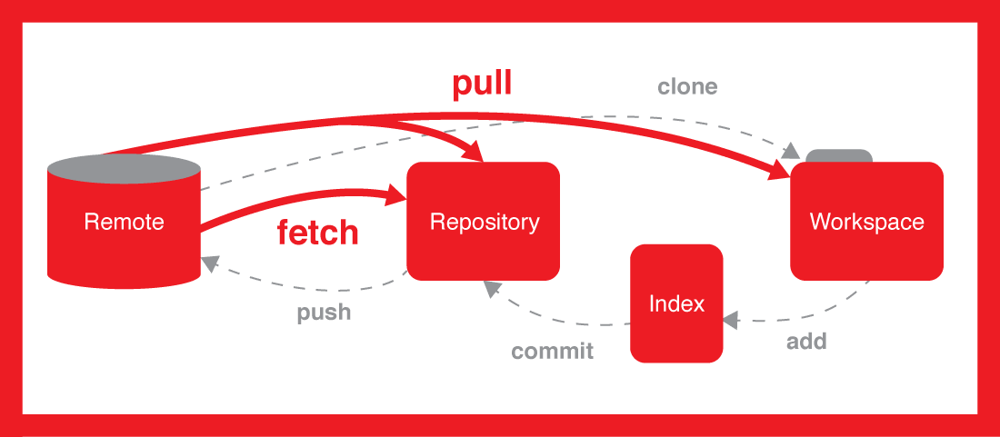

# 背景

多人协作开发软件时，最原始的方法就是互相`cp -rf`源码文件夹，2-3个人+代码不复杂的情况下，还勉强可以cover住，但随着代码复杂度增加+人数增加，源代码管理工作的cost会指数级上升，对版本issue的追溯将难如登天。

2005 年，Linux 内核开发规模庞大，原有的版本控制系统 BitKeeper 无法满足需求且因商业原因不再能为 Linux 社区所用。Linus Torvalds （Linux 内核的创始人） 便带领开发团队开发了 GIT，它快速、高效且设计精良，不仅满足了 Linux 内核开发的需求，也迅速在全球开发者社区中流行开来。

GIT没有神秘的面纱，作为开源软件，GitHub上就可以搜到它的[源码镜像](https://github.com/git/git)，但是随着功能越来越多，软件本身的复杂度还是很高的，作为工具使用者，我们无需通读源码，只需要掌握工作流中最常用的命令+不常用的询问GPT即可。

# 基本操作


## Remote-server
通常项目源码都会托管在remote server上，可以直接使用git命令来创建一个git仓库：
```bash
#server:
cd /path/to/git/repositories 
git init --bare myproject.git
#...add user ssh...

#user:
git clone git@your-server:/path/to/git/repositories/myproject.git
```
但更常见的是使用GitLab等工具私有化部署一个service，方便用户直接使用http访问网页来管理git仓库，还可以使用CI/CD DevOps等自动化功能（比如推送后自动编译检查编译错误），这些工具搭建一般是IT的工作。软件研发流程更严格的公司会附加 [Gerrit](https://www.gerritcodereview.com/)这类code review软件，对开发人员的commit进行review后才能导入项目仓库。以上这些工具一般都是由IT同事帮忙安装的。

在GitLab上创建一个项目仓库可能是PM或者技术Leader来做，

## 
# 推荐阅读