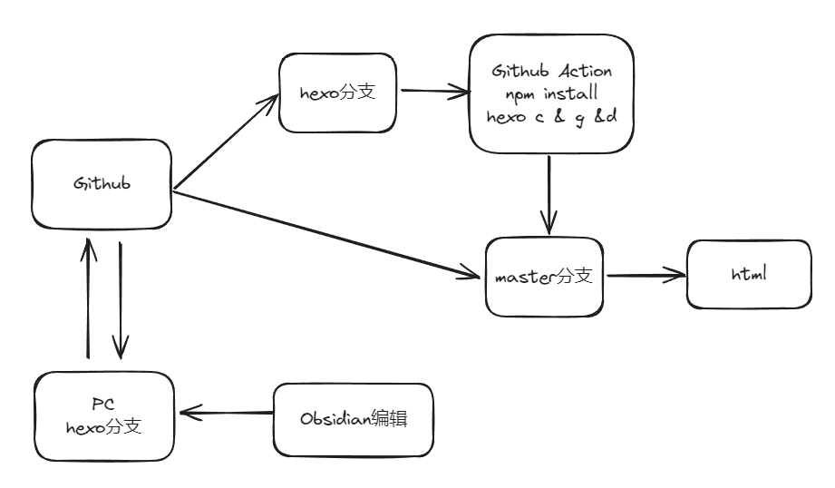
之前发布hexo博客需要在安装了nodejs的电脑上反复执行hexo g & hexo d，并且想要换台电脑就变得很麻烦，这次请Github Action代劳，于是除了第一次搭建需要本地deploy预览效果以外，其余时刻我可以抛弃nodejs只传输markdown文件，并且编辑端换上了更好用的Obsidian，快来和我一起搭建数字花园！

<!-- more -->

# Step 1: Github配置

## 新建io仓库

创建名为`$USER_NAME.github.io`的仓库，其中`$USER_NAME`为自己的GitHub用户名，GitHub会自动启用pages服务
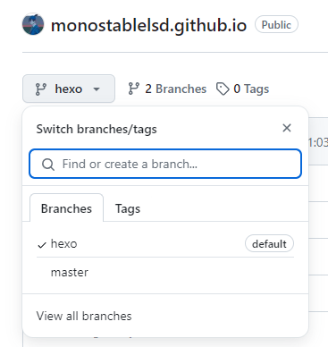
## 分支设置
- hexo分支用来存放post+config，设置为default
- master分支用来存放deploy出来的html，在Pages 设置里设置为deploy源头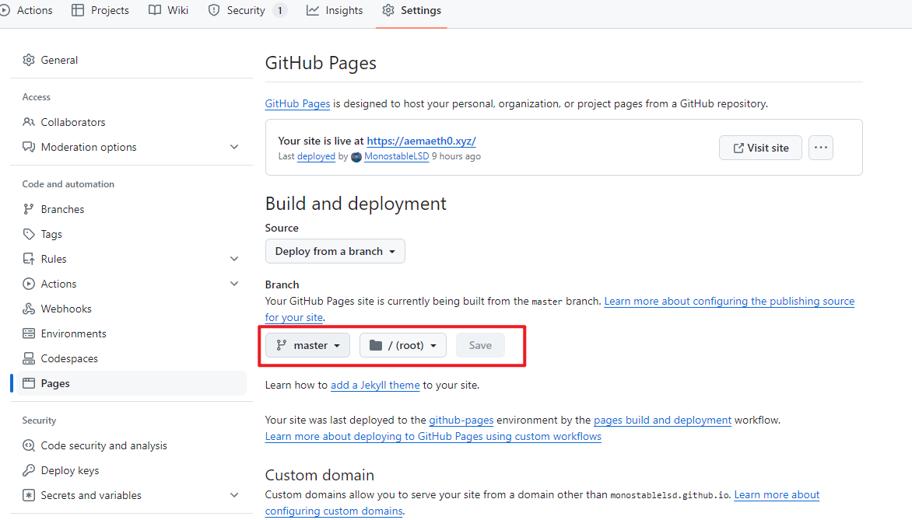
# Step 2：本地Hexo第一次搭建

## 下载环境
### 下载Git & Node.js
- [Git Download](https://git-scm.com/downloads)
- [Node.js Download](https://nodejs.org/en)
### 配置Github SSH
打开Git bash
```git
ssh-keygen -t ed25519
```
一路回车，在C:\Users\用户名\.ssh文件夹下有生成的ssh key，需要将pub内容复制到github设置里面，才能通过ssh的方式上传下载远程仓库
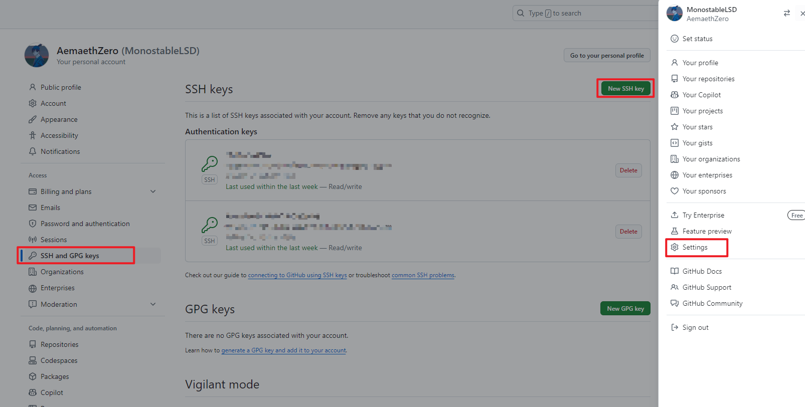
### NPM换源
装完nodejs就可以使用npm来下载hexo包了，但是npm下载node包有时因为网络问题而卡住，可以尝试换源：
```
npm config set registry https://registry.npmmirror.com/
```
### 下载仓库至本地pc
``` git
git config --global user.name "user_name" # user_name 填入 GitHub 用户名
git config --global user.email "user_email" # user_email 填入 GitHub 注册的邮箱
git clone git@github.com:MonostableLSD/monostablelsd.github.io.git
cd monostablelsd.github.io
git branch -a #确认处于hexo分支上
```
### 安装 hexo & next主题
  ```shell
  npm install hexo-cli -g
  hexo init
  npm install
  npm install hexo-theme-next@latest --save #安装next主题
  ```

  __注意不要装成theme-next__ [ref](https://github.com/next-theme/hexo-theme-next/issues/4#issuecomment-626205848)

```shell
PS C:\Users\aemaeth\Documents\MyBlog\monostablelsd.github.io> hexo -v
INFO  Validating config
hexo: 7.3.0
hexo-cli: 4.3.2
os: win32 10.0.19045 undefined
node: 20.15.1
acorn: 8.11.3
ada: 2.7.8
ares: 1.28.1
base64: 0.5.2
brotli: 1.1.0
cjs_module_lexer: 1.2.2       
cldr: 45.0
icu: 75.1
llhttp: 8.1.2
modules: 115
napi: 9
nghttp2: 1.61.0
nghttp3: 0.7.0
ngtcp2: 1.1.0
openssl: 3.0.13+quic
simdutf: 5.2.8
tz: 2024a
undici: 6.13.0
unicode: 15.1
uv: 1.46.0
uvwasi: 0.0.21
v8: 11.3.244.8-node.23
zlib: 1.3.0.1-motley-7d77fb7
```
## 配置博客页面设计

想要发布主页到`github pages`以及设计出个性化的主页，需要：

- 对博客根目录下的`_config.yml`进行参数修改

- 利用hexo5.0以后的新特性对主题配置文件进行Alternate后再修改

  ```shell
  cp node_modules/hexo-theme-next/_config.yml _config.next.yml
  ```

- __注意冒号后要空格__

### Hexo本体配置 

`_config.yml` [官方文档](https://hexo.io/docs/configuration)

```yaml
# Hexo Configuration
## Docs: https://hexo.io/docs/configuration.html
## Source: https://github.com/hexojs/hexo/

# Site 博客基本信息
title: Aemaeth0's Notes
subtitle: 'Stay Simple & Stay Naive'
description: 'EE,IC,Linux,C/C++,Control theory'
keywords:
author: Aemaeth0
language: zh-CN
timezone: 'Asia/Shanghai'

# URL 网址设置
## Set your site url here. For example, if you use GitHub Page, set url as 'https://username.github.io/project'
url: https://aemaeth0.xyz
#permalink: :year/:month/:day/:title/ #文章永久链接
permalink: archives/:abbrlink.html
abbrlink:
  alg: crc32  # 算法：crc16(default) and crc32
  rep: hex    # 进制：dec(default) and hex
permalink_defaults:
pretty_urls:
  trailing_index: true # Set to false to remove trailing 'index.html' from permalinks
  trailing_html: true # Set to false to remove trailing '.html' from permalinks

# Directory
source_dir: source
public_dir: public
tag_dir: tags
archive_dir: archives
category_dir: categories
code_dir: downloads/code
i18n_dir: :lang
skip_render: 
    - "_template/*"
    - ".obsidian/*"

# Writing
new_post_name: :title.md # File name of new posts
default_layout: post
titlecase: false # Transform title into titlecase
external_link:
  enable: true # Open external links in new tab
  field: site # Apply to the whole site
  exclude: ''
filename_case: 0
render_drafts: false
post_asset_folder: true
marked:
  prependRoot: true
  postAsset: true
relative_link: false
future: true
highlight:
  enable: true
  line_number: true
  auto_detect: false
  tab_replace: ''
  wrap: true
  hljs: false
prismjs:
  enable: false
  preprocess: true
  line_number: true
  tab_replace: ''

# Home page setting
# path: Root path for your blogs index page. (default = '')
# per_page: Posts displayed per page. (0 = disable pagination)
# order_by: Posts order. (Order by date descending by default)
index_generator:
  path: ''
  per_page: 10
  order_by: -date

# Category & Tag
default_category: uncategorized
category_map:
tag_map:

# Metadata elements
## https://developer.mozilla.org/en-US/docs/Web/HTML/Element/meta
meta_generator: true

# Date / Time format
## Hexo uses Moment.js to parse and display date
## You can customize the date format as defined in
## http://momentjs.com/docs/#/displaying/format/
date_format: YYYY-MM-DD
time_format: HH:mm:ss
## updated_option supports 'mtime', 'date', 'empty'
updated_option: 'mtime'

# Pagination
## Set per_page to 0 to disable pagination
per_page: 10
pagination_dir: page

# Include / Exclude file(s)
## include:/exclude: options only apply to the 'source/' folder
include:
exclude: 
ignore: 

# Extensions
## Plugins: https://hexo.io/plugins/
## Themes: https://hexo.io/themes/
theme: next

symbols_count_time:
#文章内是否显示
  symbols: false
  time: false
 # 网页底部是否显示
  total_symbols: true
  total_time: false

# Deployment
## Docs: https://hexo.io/docs/one-command-deployment
deploy:
  type: 'git'
  repo: git@github.com:MonostableLSD/monostablelsd.github.io.git # 你的Github仓库地址
  branch: master

```

### NexT主题配置 

`_config.next.yml` [官方文档](https://theme-next.js.org/docs/theme-settings/)

```yaml
# ===============================================================
# It's recommended to use Alternate Theme Config to configure NexT
# Modifying this file may result in merge conflict
# See: https://theme-next.js.org/docs/getting-started/configuration
# ===============================================================

# ---------------------------------------------------------------
# Theme Core Configuration Settings
# See: https://theme-next.js.org/docs/theme-settings/
# ---------------------------------------------------------------

# Allow to cache content generation.
cache:
  enable: true

# Remove unnecessary files after hexo generate.
minify: true

# Define custom file paths.
# Create your custom files in site directory `source/_data` and uncomment needed files below.
custom_file_path:
  #head: source/_data/head.njk
  #header: source/_data/header.njk
  #sidebar: source/_data/sidebar.njk
  #postMeta: source/_data/post-meta.njk
  #postBodyEnd: source/_data/post-body-end.njk
  #footer: source/_data/footer.njk
  #bodyEnd: source/_data/body-end.njk
  #variable: source/_data/variables.styl
  #mixin: source/_data/mixins.styl
  #style: source/_data/styles.styl


# ---------------------------------------------------------------
# Scheme Settings
# ---------------------------------------------------------------

# Schemes
#scheme: Muse
#scheme: Mist
#scheme: Pisces
scheme: Gemini

# Dark Mode
darkmode: false
...主题设置内容太多 具体可参考官网 https://theme-next.js.org/docs/theme-settings/
```
### 插件安装
//待续
- 搜索
### 主页手动创建
```shell
hexo new page tags /about /categories
```
### 本地预览效果
通过config修改网页配置后，想要预览一下效果，可以hexo本地部署：
```
PS C:\Users\aemaeth\Documents\MyBlog\monostablelsd.github.io> hexo clean
INFO  Validating config
INFO  Deleted database.
INFO  Deleted public folder.
PS C:\Users\aemaeth\Documents\MyBlog\monostablelsd.github.io> hexo g
INFO  Validating config
INFO  ==================================
  ███╗   ██╗███████╗██╗  ██╗████████╗
  ████╗  ██║██╔════╝╚██╗██╔╝╚══██╔══╝
  ██╔██╗ ██║█████╗   ╚███╔╝    ██║
  ██║╚██╗██║██╔══╝   ██╔██╗    ██║
  ██║ ╚████║███████╗██╔╝ ██╗   ██║
  ╚═╝  ╚═══╝╚══════╝╚═╝  ╚═╝   ╚═╝
========================================
NexT version 8.20.0
Documentation: https://theme-next.js.org
========================================
INFO  Start processing
Markdown Image Path: 
asset_img string: 
Markdown Image Path: 
asset_img string: 
Markdown Image Path: 
asset_img string: 
Markdown Image Path: 
asset_img string: 
INFO  Files loaded in 134 ms
INFO  Generated: about/index.html
INFO  Generated: categories/index.html
INFO  Generated: archives/66464b4a.html
INFO  Generated: archives/2024/index.html
INFO  Generated: archives/2019/index.html
INFO  Generated: archives/2020/index.html
INFO  Generated: archives/2019/01/index.html
INFO  Generated: archives/2020/01/index.html
INFO  Generated: tags/index.html
INFO  Generated: search.xml
INFO  Generated: archives/2024/07/index.html
INFO  Generated: categories/Tech/index.html
INFO  Generated: tags/obsidian/index.html
INFO  Generated: images/favicon-16x16-next.png
INFO  Generated: tags/hexo/index.html
INFO  Generated: tags/Without-OS/index.html
INFO  Generated: tags/github/index.html
INFO  Generated: tags/MCU/index.html
INFO  Generated: index.html
INFO  Generated: archives/53bd0ece.html
INFO  Generated: archives/e12db737.html
INFO  Generated: archives/index.html
INFO  Generated: archives/e12db737/image-20240718101929351.png
INFO  Generated: images/back/apple-touch-icon-next.png
INFO  Generated: images/favicon-32x32-next.png
INFO  Generated: images/apple-touch-icon-next.png
INFO  Generated: images/avatar.gif
INFO  Generated: images/logo.svg
INFO  Generated: js/comments.js
INFO  Generated: css/main.css
INFO  Generated: CNAME
INFO  Generated: images/algolia_logo.svg
INFO  Generated: js/third-party/addtoany.js
INFO  Generated: images/cc-by-nc.svg
INFO  Generated: js/third-party/analytics/matomo.js
INFO  Generated: images/cc-by-nc-sa.svg
INFO  Generated: images/cc-by-sa.svg
INFO  Generated: images/cc-by-nd.svg
INFO  Generated: images/cc-zero.svg
INFO  Generated: images/cc-by.svg
INFO  Generated: images/quote-r.svg
INFO  Generated: images/cc-by-nc-nd.svg
INFO  Generated: images/weChat-pub.jpg
INFO  Generated: archives/e12db737/image-20240718100249490.png
INFO  Generated: images/weChat.png
INFO  Generated: css/noscript.css
INFO  Generated: js/motion.js
INFO  Generated: js/config.js
INFO  Generated: images/hexo-avatar.png
INFO  Generated: js/sidebar.js
INFO  Generated: js/next-boot.js
INFO  Generated: archives/e12db737/image-20240718100611979.png
INFO  Generated: js/utils.js
INFO  Generated: archives/e12db737/image-20240718104540557.png
INFO  Generated: js/third-party/search/local-search.js
INFO  Generated: images/net-logo.png
INFO  Generated: images/back/hexo-avatar.png
INFO  Generated: images/benjamin-voros-phIFdC6lA4E-unsplash.jpg
INFO  59 files generated in 380 ms
PS C:\Users\aemaeth\Documents\MyBlog\monostablelsd.github.io> hexo s
INFO  Validating config
INFO  ==================================
  ███╗   ██╗███████╗██╗  ██╗████████╗
  ████╗  ██║██╔════╝╚██╗██╔╝╚══██╔══╝
  ██╔██╗ ██║█████╗   ╚███╔╝    ██║
  ██║╚██╗██║██╔══╝   ██╔██╗    ██║
  ██║ ╚████║███████╗██╔╝ ██╗   ██║
  ╚═╝  ╚═══╝╚══════╝╚═╝  ╚═╝   ╚═╝
========================================
NexT version 8.20.0
Documentation: https://theme-next.js.org
========================================
INFO  Start processing
INFO  Hexo is running at http://localhost:4000/ . Press Ctrl+C to stop.
```
浏览器访问http://localhost:4000/即可预览
### 发布博客
至此，在_config.yml中配置好deploy
```
# Deployment
## Docs: https://hexo.io/docs/one-command-deployment
deploy:
  type: 'git'
  repo: git@github.com:xxx.git # 你的Github仓库地址
  branch: master
```
就可以通过
```
hexo d
```
将网页部署到github master分支上去，它就可以自动渲染html页面了，但每次都要借助hexo cli来更新博客，还是感觉有点麻烦，因此借助github action来实现自动部署
## Github Action
### 配置deploy脚本
在本地hexo分支下新建.github/workflows/hexo-deploy.yml
```
name: Hexo Deploy
on:
  push:
    branches:
      - hexo
env:
  GIT_USER: aemaeth
  GIT_EMAIL: monostablelss@gmail.com


jobs:
  build:
    runs-on: ubuntu-latest
    steps:
      - name: Checkout deploy branch
        uses: actions/checkout@v2
        with:
          ref: hexo
          path: ./

      - name: Set up Node.js
        uses: actions/setup-node@v2
        with:
          node-version: 14

      - name: Remove Deploy_git
        run: |
          rm -rf .deploy_git

      - name: Install dependencies
        run: |
          npm install && npm run build

      - name: Hexo c & g
        run: |
          npm run build
          
      - name: Configuration environment
        env:
          HEXO_DEPLOY_PRI: ${{secrets.HEXO_DEPLOY_PRI}}
        run: |
          mkdir -p ~/.ssh/
          echo "$HEXO_DEPLOY_PRI" > ~/.ssh/id_rsa
          chmod 600 ~/.ssh/id_rsa
          ssh-keyscan github.com >> ~/.ssh/known_hosts
          git config --global user.name $GIT_USER
          git config --global user.email $GIT_EMAIL

      - name: Deploy
        run: |
          npm run deploy
```
Github Action的原理是，通过一个yml告诉github要做的workflow，它会在一个虚拟环境里面帮忙执行workflow里面的操作，github提供一个action market，可以调用这些market里面的action，本质是虚拟了一个命令行环境，可以认为是另一台电脑。
上面的yml描述了这样的workflow：当hexo分支push时触发这个workflow，虚拟一个ubuntu环境，先checkout下载repo hexo分支，再帮忙按照package.json描述npm安装node包，pacage.json如下：
```
{
  "name": "hexo-site",
  "version": "0.0.0",
  "private": true,
  "scripts": {
    "build": "hexo clean && hexo generate",
    "clean": "hexo clean",
    "deploy": "hexo deploy",
    "server": "hexo server"
  },
  "hexo": {
    "version": "7.3.0"
  },
  "dependencies": {
    "hexo": "^7.3.0",
    "hexo-abbrlink": "^2.2.1",
    "hexo-deployer-git": "^4.0.0",
    "hexo-filter-nofollow": "^2.0.2",
    "hexo-generator-archive": "^2.0.0",
    "hexo-generator-category": "^2.0.0",
    "hexo-generator-index": "^4.0.0",
    "hexo-generator-searchdb": "^1.4.1",
    "hexo-generator-tag": "^2.0.0",
    "hexo-image-link": "^0.0.6",
    "hexo-renderer-ejs": "^2.0.0",
    "hexo-renderer-marked": "^6.3.0",
    "hexo-renderer-stylus": "^3.0.1",
    "hexo-server": "^3.0.0",
    "hexo-symbols-count-time": "^0.7.1",
    "hexo-theme-next": "^8.20.0"
  }
}
```
npm run build即执行 hexo clean && hexo generate，生成要发布到master的public文件
### 设置deploy key
当github action帮我们在虚拟环境里hexo d的时候，这个环境是没有ssh权限的，因此需要偷偷给虚拟环境一个密钥，并且把公钥告诉github，这里要用到github secret功能
首先在本地pc生成一对公钥密钥
```
ssh-keygen -f github-deploy-key
```
将密钥（非pub后缀）内容复制进github secret，并命名HEXO_DEPLOY_PRI
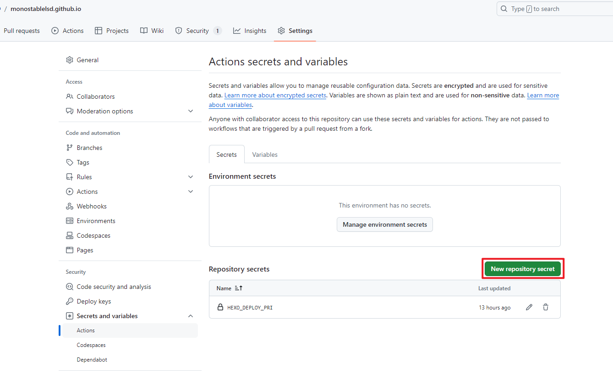
将公钥(pub后缀)内容复制进github deploy key，并命名HEXO_DEPLOY_PUB
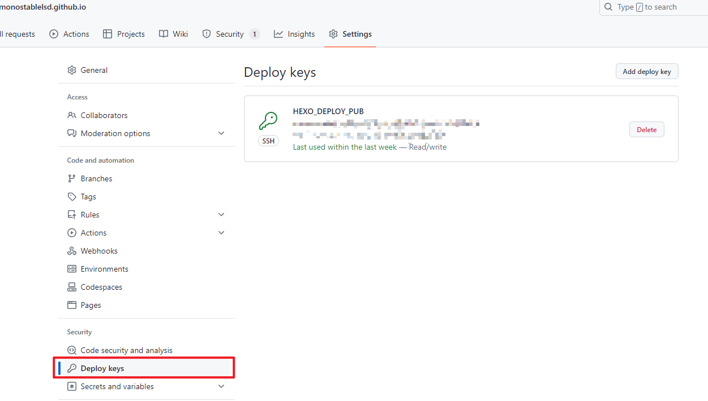

通过yml脚本取出secret密钥存入虚拟环境的.ssh中，并配置git操作，这样才能正常hexo d
```
      - name: Configuration environment
        env:
          HEXO_DEPLOY_PRI: ${{secrets.HEXO_DEPLOY_PRI}}
        run: |
          mkdir -p ~/.ssh/
          echo "$HEXO_DEPLOY_PRI" > ~/.ssh/id_rsa
          chmod 600 ~/.ssh/id_rsa
          ssh-keyscan github.com >> ~/.ssh/known_hosts
          git config --global user.name $GIT_USER
          git config --global user.email $GIT_EMAIL
```
### 调试workflow
如果遇到问题可以在github action页面看到workflow的log，可以帮助定位问题
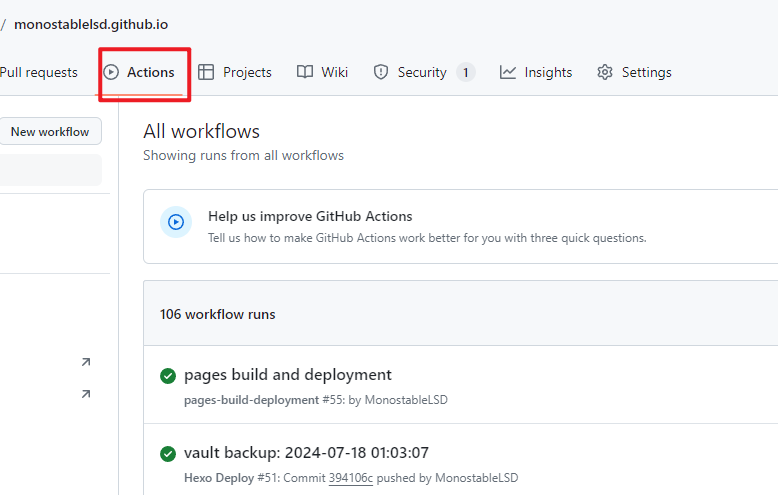

### 错误邮件通知
可以修改GitHub notification使workflow失败时发邮件通知
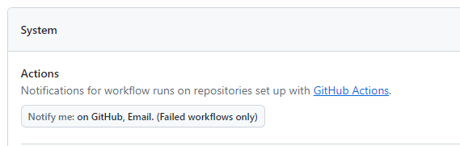
### gitignore配置
一旦完成了action流程调试、不再需要hexo cli来操作博客，就可以放弃nodejs，因此可以gitignore掉node_moudules等比较大的文件
```
.DS_Store
Thumbs.db
db.json
*.log
node_modules/
.deploy*/
public/
# Ignore Smart Connections folder because embeddings file is large and updated frequently
.smart-connections
.trash
.stignore
```
## Obsidian配置
### 打开仓库
打开source文件夹作为obsidian工作库，这时obsidian会在source下新建一个.obsidian文件夹用于存obsidian的信息与插件，我选择将其传入git，这样方便我在其他电脑上clone下来使用，可以在_config.yml中跳过这些文件夹的渲染
```
skip_render: 
    - "_template/*"
    - ".obsidian/*"
```
设置新文件路径：
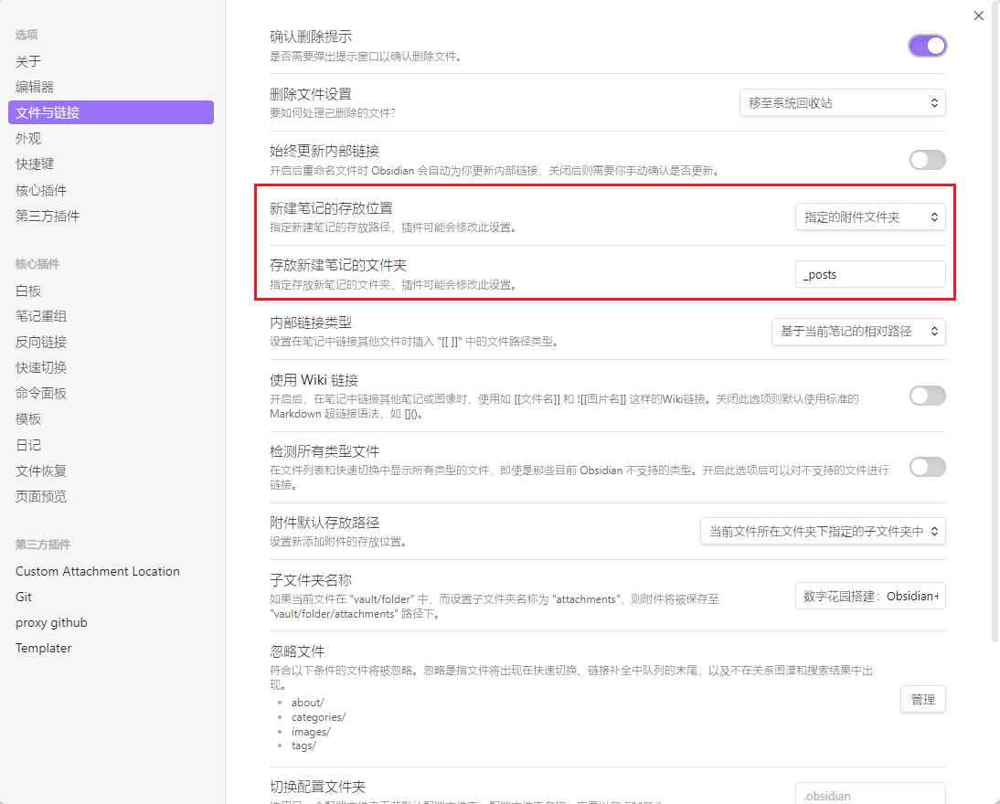
### 文件头模板
不使用hexo new来新建md时，需要手动添加文件头，obsidian有[Templatter](https://github.com/SilentVoid13/Templater)方便插入
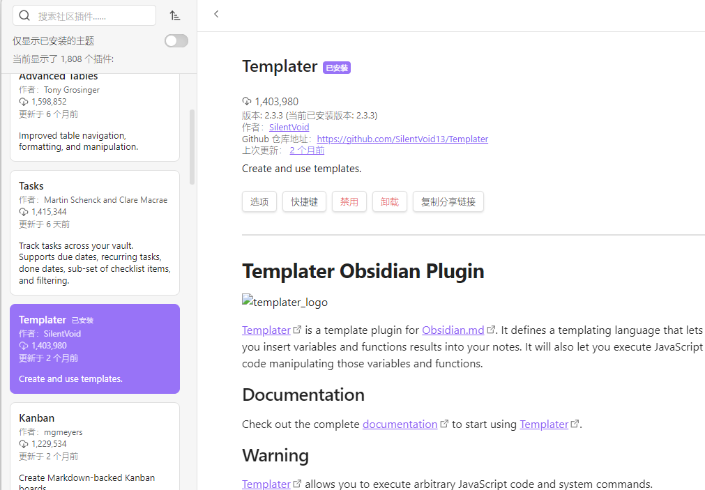
在source文件夹下新建一个_template/tp-hexo-post-init.md
```
---
title: '<% tp.file.title %>'
categories:
tags:
mathjax: true
date: <% tp.date.now("YYYY-MM-DD HH:mm:ss") %>
updated: <% tp.date.now("YYYY-MM-DD HH:mm:ss") %>
---
```
设置模板文件夹为_template
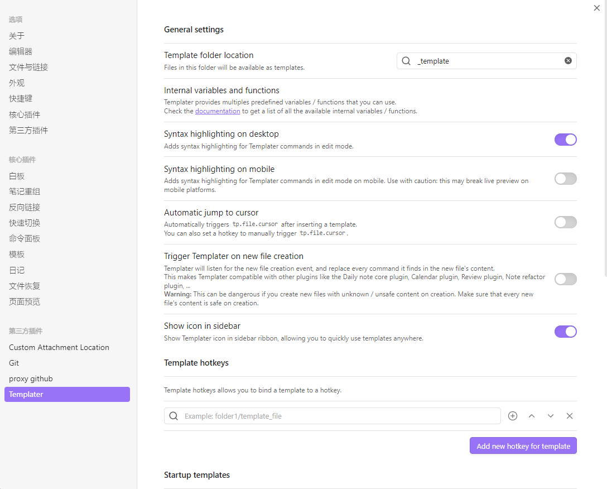
同时_config.yml跳过渲染
```
skip_render: 
    - "_template/*"
    - ".obsidian/*"
```
新建博客后，点击左侧Templater符号即可插入
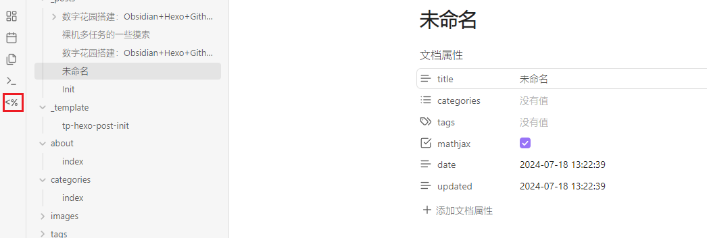
### 图片粘贴
想要hexo渲染图片原本不是一件容易的事情，但是可以利用obsidian的[Custom Attachment Location](https://github.com/RainCat1998/obsidian-custom-attachment-location)插件与[Hexo asset folder机制](https://hexo.io/docs/asset-folders)方便实现。前者会在用户向post粘贴图片时，自动创建一个post同名文件夹用来存储图片，并以相对路径应用；后者可以通过在_config.yml中设置打开post_asset_folder功能自动从同名文件夹中索引图片生成html。
#### Custom Attachment 设置
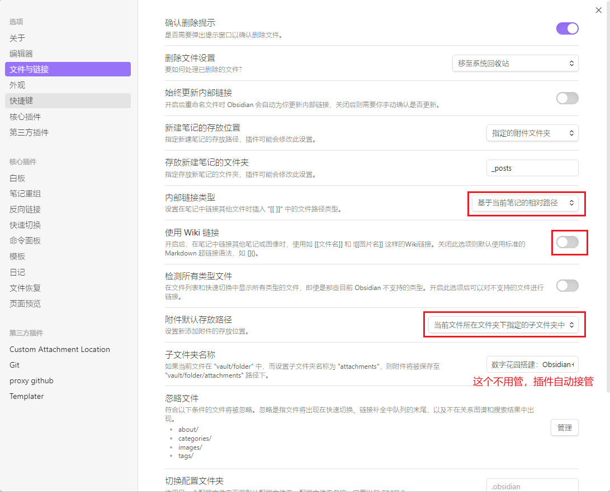
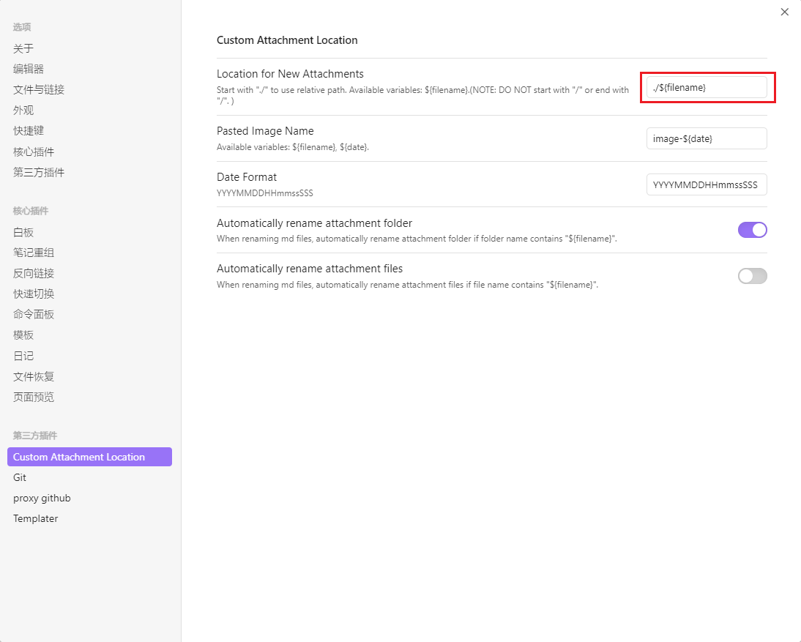
#### Hexo Asset Folder设置
修改_config.yml
```
post_asset_folder: true
marked:
  prependRoot: true
  postAsset: true
```
#### 效果
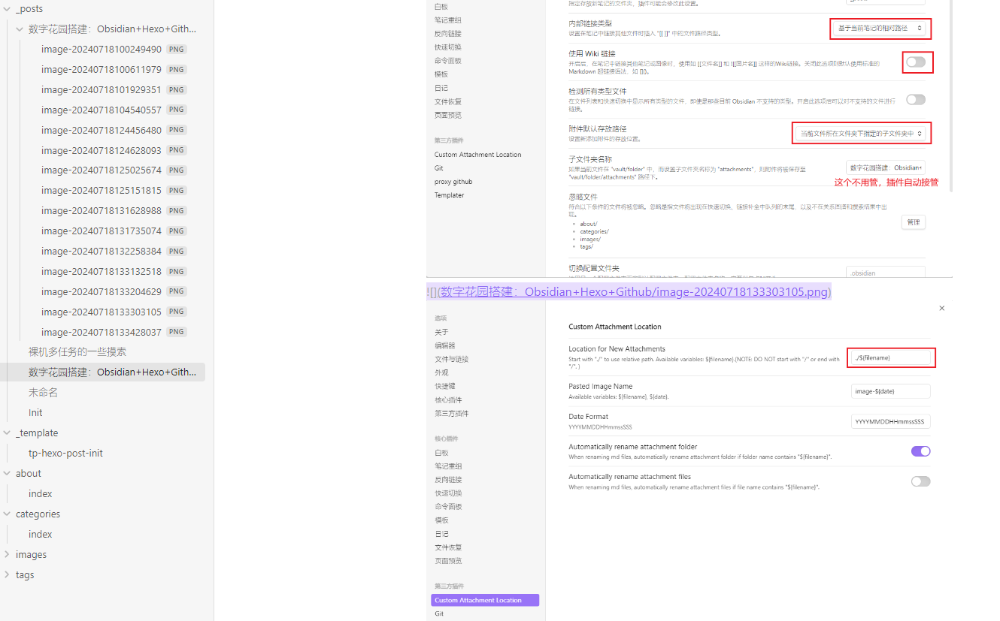
### Obsidian Git
安装[Git](https://github.com/Vinzent03/obsidian-git)插件，按Ctrl+P，输入commit all change+push提交博客，自动发布

# Step 3：日常管理
经过如上一番操作，日常情况就可以抛弃nodejs，在某处的新电脑上，可以先配置好git、下载好obsidian，就可以开始更新博客了！
  

