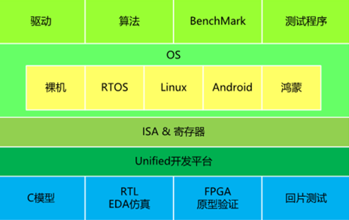
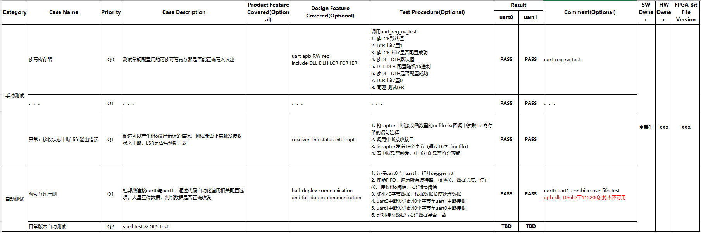
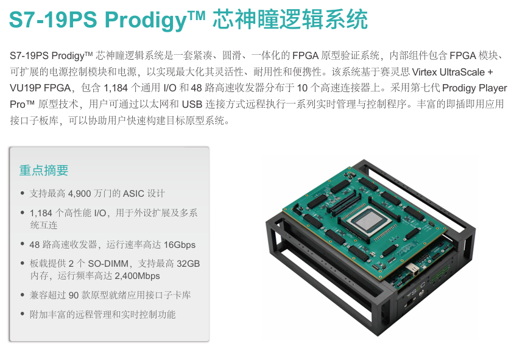
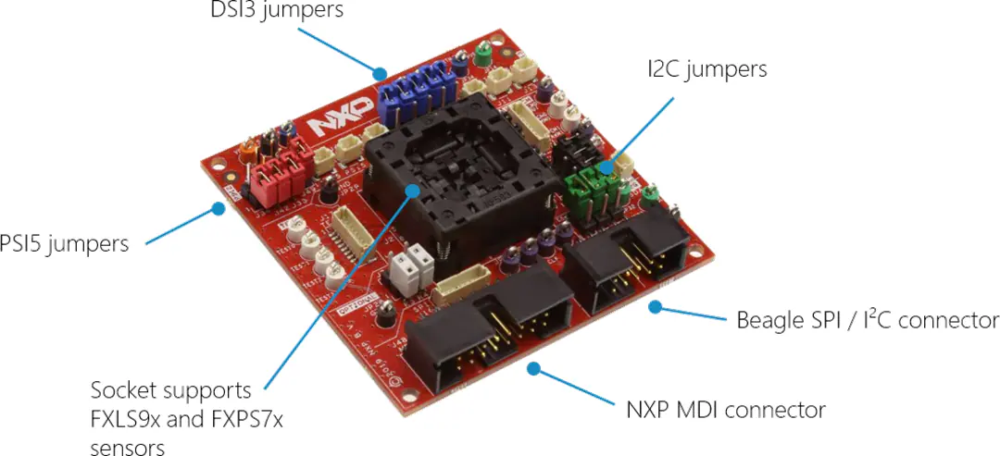

在学校每天call stm32 hal库的时候，总是在想，芯片原厂的软件工程师是不是特别nb。我对体系结构、芯片内部的细节这些东西有着天然的好奇心，但工科的知识不是靠看一两本书就能掌握的，要实践才能螺旋提升认识。毕业后运气好进了一个消费电子的芯片部门，终于小小窥见芯片软件的一些奥妙，它是矛盾的，芯片内部的这些智慧结晶有着强烈的赛博美感，但手里搬砖的活却多少有些苦逼，让我们一起看看芯片设计公司的嵌入式软件都在干什么。

<!-- more -->
# 工作内容概述

> [ic.designer.meme instagram](https://www.instagram.com/ic.designer.meme/)

作为Fabless芯片设计公司，最底层的任务就是设计有市场的芯片并成功流片，这里面有几个风险：
- 市场变化快，芯片研发慢
- 芯片太复杂，流片又太贵
因此，有各种方法来降低风险，为了尽快+成功流片，流片前就要想尽办法验证设计是不是有问题。结合自己的实际工作，我认为芯片软件一般在全流程中负责3个主要工作：
1. **硅前（pre-silicon）FPGA原型验证**：流片（tape out）前用FPGA验证设计，借助FPGA/EDA仿真环境协助前端数字IC Designer对bug进行定位
2. **硅后（post-silicon）Bringup**：芯片制造、封装好后，拿回来装在EVB上进行一系列实测，~~~必要时进行一些软件兜底补救措施~~~
3. **SDK/HAL软件包交付**：芯片卖给客户，总不能让客户照着寄存器手册做应用，所以要编写SDK及其文档，最好能写一些应用demo
另外，还有一些上位机、自动化脚本的开发，这些一般不是release给客户级别的，借助ChatGPT和一点点QT/C#/Python基础就可以做到。
# FPGA原型验证
## Testcase表格
一个新芯片项目kickoff时，一般前期的市场分析、架构设计差不多就做完了。RTL未动，文档先行。数字前端的哥们会开始写各个模块/IP的微架构文档（Micro Architecture Spec），等他们写好MAS，软件就可以开始编写TestCase。具体来说，TestCase就是一个验证计划excel，根据IP功能规划FPGA环境上要验什么，一个UART的TestCase例子：

什么样的TestCase才算一个好的TestCase？我认为这是一个吃经验的事情，必须对设计内部有一定理解，并且有大局观能够掌控好一种验证的边界感，要时刻铭记”尽快成功流片“的目标，要尽可能验到每一种实际可能出现的情况，但不能异想天开整一些非常极端钻牛角尖的case。
接着就是写一个初步的测试代码，为了保证rtl freeze deadline前能顺利验完，验证代码不用特别考虑代码可移植性等面向用户的特性，不过如果后面SDK阶段想要少做一些重复工作，可以自己权衡要做到什么程度，这一阶段的首要目标是验证功能，如果一个简单的模块要写好几天驱动代码，会被PM蛐蛐的，SDK那种架构严谨的代码可以等到rtl freeze后再慢慢整。因为这个时候可能还没有具体的rtl 设计，因此只是一个初步的验证代码框架。
做好TestCase和初步代码，一般会拉着软件同事和前端设计一起review一下，看下有没有什么遗漏的点。
## 等待Bitfile
前期一般不会很快拿到Bitfile，RTL IP Coding完还要集成，集成完还要综合，~~这个时间难道可以摸鱼挂机吗（狂喜）~~？除了看MAS、写TestCase及代码，我们还可以看下架构文档，进一步了解芯片的使用场景。此外，我们EDA验证同事还帮忙搭建了一个名为”Quattro“的VCS环境，用于在综合前进行top级C仿真，这个平台可以吃我们编译出的程序bin文件，启动CPU执行，并dump出详细的fsdb波形，与FPGA验证形成了互补，后期有一些FPGA验证过程遇到的设计bug，如果要综合出带debug ILA的bit会很慢，Quattro更方便看到内部的信号（虽然top级VCS仿真也要跑几个小时）。
总之，这是一段相对不忙的时间。
## 正式FPGA验证
敲锣打鼓FPGA工程师终于release了第一个版本的bitfile。Vivado，启动！烧录bit进FPGA平台，就可以把它当作一颗SOC使用了，一般最先开始的是jtag和cpu启动，负责启动的同事要保证工程能run到main函数，接着负责uart的同事确保串口能正常使用，以便打印调试信息，这样其他哥们就能开始各个模块的验证了。
需要注意FPGA环境与真实环境会不一样，一定要注意分频可能会导致的问题，比如FPGA上这个CLK下一切正常，结果客户板子上晶振不一样，导致内部分频分不出精准的CLK，那就寄了。
图为[S2C S7 FPAG验证平台]([一体化原型验证平台满足各种IC设计验证需求 | 思尔芯S2C-思尔芯 | S2C (s2ceda.com)](https://www.s2ceda.com/ch/product-prototyping-ls-3))

## Bug提交定位
验证过程中遇到问题提bugzilla给前端同事，必要时联合eda验证与前端一起定位bug，修改后回归验证，整个过程要记录在调试验证文档
## 自动回归验证
在验证过程中，bit版本会不停的更新，不论更新是否涉及到咱们负责的模块都应该再回归验证一遍，如果每个case都要手动比对波形来测，那真的很Dirty Work，此时testcase代码自动化就很重要，必须要开动脑筋做成自动化测试，在硬件连接符合要求的情况下，每天在一台fpga上自动跑尽可能多的testcase的回归，确保bit更新没有引入新的问题。
## 场景验证
按照项目实际需求，会有多个模块+外设联合工作的场景验证。在rtl freeze以前，必须完成所有ip的验证以及基本的系统级场景验证，工期比较赶的情况下，全面的场景验证将在rtl freeze后进行。

FPGA验证与EDA验证（前仿）作为数字前端设计的双保险，开始做TestCase时不能互相参考，以免思路重复，一些边角case两边都没验到，后期可以互相看下，以免出现我以为他验，他以为我验了这种比较尴尬的情况。流片的压力还是比较大的，但相比设计哥们的压力小一点，工资也比设计哥们低一点。这就是责任的问题，在企业，责任越大价值越大。芯片研发本就具有研发难度与流片风险，作为工程师，有技术底气、做好细节，就不怕担责。
# Bringup & SDK软件包交付
## 第一次点亮
rtl freeze后，后端的哥们还有很多工作，最后做出gds文件给Fab厂，Fab厂制造出wafer后给封测厂进行封测，如果一切顺利，将在几个月后收到实体的芯片。将芯片装上socket EVB，Bringup最刺激的时候到了，上电看芯片能不能起来，这种时候所有人都聚集在实验室看软件操作，硬件的哥们会仔细检查电源、晶振是否OK，做启动的软件要先看jtag能不能识别cpu。
公司的Socket EVB不方便拍照，这里放上来NXP的一张SocetEVB，结构都比较类似。

## 功能与性能
芯片启动后，进入后续的Bringup流程，会根据FPGA验证阶段的分工，先验功能再验性能。功能验证从IP到场景，性能会测比如功耗等参数是否达到Spec要求。
这个过程中，软件就会开始修建SDK了，在验证代码的基础上进行修改裁剪，保证风格统一、接口简洁。对修改好的代码在fpga上进行验证，验证重点在于确保接口没有严重bug（这里其实需要专业的软件测试流程）。最后编写从系统到单个ip的软件用户手册，通常参考mcu大厂的一些用户手册。

