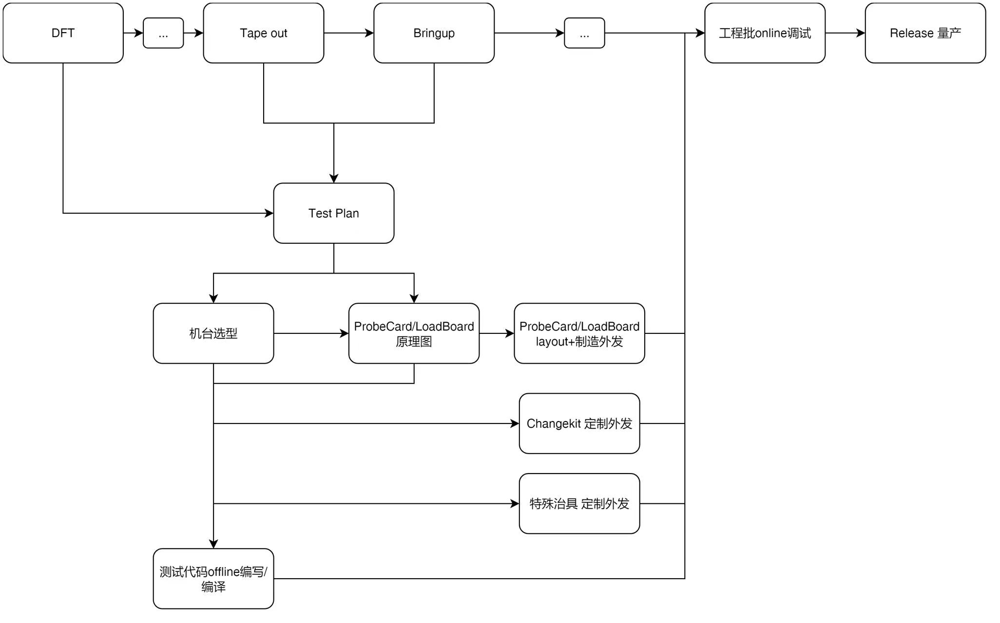
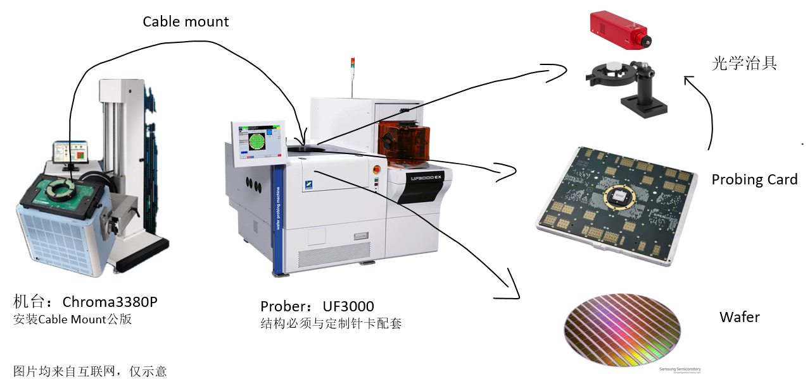

芯片产业分为设计、制造、封装三大流程，在封装后还会进行量产测试，因此又称为封测流程。今年上半年我在公司负责ASIC SOC的量产测试工程，这里总结一下项目流程，以便日后项目参考。

<!-- more -->

# Step0 收集产品信息

大部分芯片产品的商业价值在底层逻辑上都是需要量产来兑现的。一般一个成熟的芯片项目，比如迭代产品，已经有明确量产的市场，那么应该在流片后就开始准备量产测试事宜，如果更赶，则应该在DFT设计确定后开始准备。对于市场不明确、预研性质较高的流片项目，则可以在Bringup后再考虑是否要做量产测试。

在制定具体的Test Plan之前，量产测试工程师应该汇集各方信息，以全面了解DUT设计特性。具体来说，可以跟前端、后端、版图各方同事沟通，获取关于芯片制造的详细信息，汇集成一个表格，这个表格将帮助各方（包括外发供应商）对齐产品信息。

通常要包括以下信息：

*   基本信息：
    *   产品型号（公用代号）
    *   产品类型 （消费级/车规级/...）
    *   应用领域
*   Wafer信息
    *   Fab （e.g. TSMC 28nm）       
    *   尺寸 （8寸/12寸）
    *   厚度
    *   gross die (一片wafer上总共多少die)
    *   die在wafer上的分布信息
        *   die size with seal ring
        *   street size /dicing width
        *   step number
        *   ... (不同厂家的命名略有不同，可以拉后端/厂家沟通)
    *   die上信息
        *   die 厚度
        *   pad 数量
        *   pad 尺寸
        *   pad 厚度
        *   pad 材质
        *   circuit under pad （pad下是否有电路）
        *   ...
    *   Wafer Map
    *   Pad Loacation
*   Package信息
    *   封装方案/工艺 （COB/WB/FCBGA/....）
    *   不同封装工艺的Package信息有所不同，量产测试工程师应该多了解制造、封装工艺，这里以FCBGA举例
    *   Bump信息
        *   Bump类型（Cu-Pillar/Plating Solder）
        *   Bump pitch
        *   Bump 高度
        *   Bump 尺寸
        *   ...
    *   BGA Pad Location/ Pin Map

这个表格可以随项目推进继续补充信息。

# Step1 制定Test Plan

测试工程师需要通过与Designer+DFT同事沟通后，制定一份Test Plan。Test Plan应该包含测试的condition描述、工程批次要收集的数据（e.g. ADC读数、shmoo图）、具体的Test Case。

测试condition需要确认产品是否有需要调整温度、电压、光照等环境参数的测试需求，具体来说，是否需要做高低温测试？高低温要到多少度？跑Case的时候几路电源是否要调整电压？是否需要外部光源？这些都会影响到handler、机台等硬件的方案。

另外对于某些不太成熟的模块，Designer可能会需要量产测试工程师在实验室或工程批调试时帮忙额外收集数据，比如一批芯片的ADC读数，作为一致性依据；又比如需要借助ATE工具获取产品各个case的shmoo图，以更全面了解产品的特性。

接下来就是具体的Test Case，通常Test Case包含4个部分：

1.  Continuity Test
2.  DC Test
3.  Gross Function Test / IP Test
4.  Function Test

## Continuity Test

为了首先确保机台到芯片的连接正常，通常最先要做Open Short开短路测试，要求量产测试工程师获取IO后端设计细节，是否每个pin提供对VSS对VDD保护二极管，包括电源管脚、模拟(adc/phy)管脚、数字管脚。对于不同的设计要制定对应的OS方案。

## DC Test

可选：

1.  Gross IDD ：粗测芯片上电后功耗
2.  Static IDD ：load最低功耗pat，测试VDD电流
3.  Dynamic IDD ：load最高功耗pat，测试VDD电流
4.  Input Leakage Test (IIL&IIH)：测量input pin 输入low情况下的漏电流
5.  Output Tristate Leakage Test (IOZL & IOZH)：测量output pin置为高阻态时对应高低两种情况的漏电流

要求量产测试工程师获取仿真信息/Bringup EVB实测数据，获取上电流程细节+进入高低功耗模式的方法。通常漏电流会有仿真信息，IDD在EVB上会有参考值，具体要认识到不同模式下时钟树的状态。

## Gross Function Test / IP Test

复杂数字电路依赖DFT进行量产测试。要求量产测试工程师仔细阅读DFT设计文档，了解相关的测试原理，关注每一个DFTcase的如下信息：

1.  如何进入DFT mode
2.  DFT mode 下 pin remap到了哪里，重点关注DFT IJTAG与插入的时钟结构
3.  pattern中使用了哪些pad
4.  哪些pad作为异步、同步时钟，频率min max分别多少
5.  pattern执行的timing（DT0 DT1 CT0 CT1），pattern执行的频率
    
对于复杂IP的DFT Test需要根据具体情况来处理：

比如，USB3.0 ip具有ijtag直连进行bist内部测试以及bert外部回环测试的功能，需要阅读IP供应商文档来获取具体的硬件设计指标与ATE操作流程。根据需要可以选型具有高速IP功能的ATE机台，比如93K带有封装好的LVDS功能，可以用来专门测试复杂IP。

## Function Test

以上的测试基本可以覆盖数字电路部分以及PHY的部分，芯片上还会有一些数模混合的部分以及die外多chip封装的部分，具体来说，比如ADC、DAC模块，以及封装在一起的Flash芯片，这些通常需要进行功能测试来覆盖。与DFT进入DFT mode再测试不同，Function Test往往是让芯片进入正常的工作状态，通过JTAG/SSPI等接口通过寄存器操作外设功能来进行测试。具体一个芯片项目要测哪些Function Test，要与Designer沟通确定方案细节。

CP主要目的是为了检测Foundry的制造问题，FT主要目的是为了检测Package的制造问题，因此二者的Test Plan存在差异。比如CP阶段还没有封装Flash，自然没有Flash测试。另外CP扎针与FT Socket硬件连接上的电气参数也有不同，二者片上散热热阻也有不同，这些区别在特殊情况下也会引入Test Plan中进行不同的处理。

以上就是基本的Test Plan结构，具体还是要看芯片，特殊的产品设计可能需要一些特殊的Test Plan，比如需要耦合CP/FT流程，CP阶段的数据存进片内存储，FT再解出来使用。遇到特殊的Test Plan，需要仔细评估可行性，并且联系到硬件平台的spec，比较考验量产测试工程师的综合能力。

# Step2 准备硬件

只有当Test Plan关键细节都确定好后，才能开始准备硬件的环节。根据Test Plan各个case的指标，要做以下硬件准备工作：

1.  ATE机台+资源板卡选型+确定site数
2.  ProbeCard/LoadBoard+changkit+socket等硬件定制外发
3.  特殊治具定制

## 机台选型

机台选型第一步是确定Test Plan在哪些机台上是可行的。比如就是要用ATE测LVDS，那么业界主流机台哪些有LVDS功能？

机台选型有几个突出的指标：

1.  逻辑通道数
2.  pattern执行IO最大频率
3.  电源板卡供电能力
4.  pattern memory最大支持行数
5.  ...(其次是一些特殊IP测试功能)

根据前期收集的芯片信息，可以知道一颗芯片测试需要多少电源与IO channel，比如一颗die上有好几百个pad，实际封装后ball有200多个，最后连到ATE机台LPC数字IO的只有100多个，使用Chroma3380P最大IO数资源板卡配置即可实现4site同测。另外，还需要估算确定机台能不能存下Test Plan里所有的Pattern。

第二步是考虑成本与封测厂能力。封测厂有哪些机台可以用？是否支持采购新机台？机时费多少？这些问题要求量产测试工程师提前沟通了解。市面上主流的ATE厂家数量不多，建议优先在主流方案中选型，如果量产测试研发能力强，也可以考虑国产机台，目前新的国产机台功能丰富，但应用是否稳定可靠有待市场验证。

这两步做完，基本可以确定2-3个机台型号并且确定对应的同测site数，通过成本估算可以出一个trade off比较方案。

## 测试硬件制造外发

Test Plan确定、机台选型确定后，测试硬件方案基本框架就定下了，对应的测试硬件也不会有太多可选。比如die上有800多个pad的芯片如果做CP，肯定无法做悬臂针，必须上MLO垂直针，不同供应商的垂直针技术还不太一样，价格也有差异。除了CP针的方案，还有机台连接方案：是cable mount、pogo tower还是direct docking？这些芯片信息和Test Plan大致信息同步给供应商，他们一般会要求量产测试工程师填一个产品信息表格，根据对齐的信息会帮忙给一个大致的参考方案。

因此这时的主要工作是和各个供应商沟通，沟通方案细节、价格、交期等事项。大部分的针卡、LB外包商都需要提供原理图，有些也包原理图设计，但无论哪种都需要有一定经验的硬件工程师进行review。如果项目非常赶工，要求在Test Plan没有完全敲定的情况下进行硬件外发，那么可以多做冗余设计，留好余地。与芯片流片类似，需要实体制造的device都需要比较长的准备时间，因此这个时间最好能和tape out重叠，并且尽快发包出去，量产测试工程师还可以并行写代码。

CP的方案除了ProbeCard的设计制造，还有针的制造，部分供应商的MLO针制作不在国内，需要比较长的交期，要求量产测试工程师、PM安排好项目进度。

FT的方案除了LoadBoard的设计，还有Socket、Changkit的制造，有些项目中是由封测厂协助发包，务必确认好三方间的信息，千万注意不要搞出socket尺寸与changekit对不上的这种问题。因此，外发硬件制造完成后，一定要第一时间进行QC，如果有问题返工会对项目进度造成严重影响。

## 特殊治具定制

除了以上描述的常规量产测试硬件准备，sensor类芯片往往还需要光学环境，这些在Test Plan制定时最好把光学环境细节确定清楚，要充分考虑机械结构约束，同时如果治具需要固定在针卡、loadboard，那么方案也要同步给外包。

在无锡积高封测听了合肥晶测的光学测试技术介绍，关于光学治具的方案，也可以联合有能力的封测厂及其供应商一起联合制定。

# Step3 offline编写ATE测试程序

理论上只要机台选型结束，ATE工程就可以开始搭建了。各家ATE使用的语言、开发环境都不太一样，但原理相似。在这个阶段主要要做3件事情：

1.  转换DFT pattern
2.  实现channel list关系
3.  实现Test Plan到ATE代码
    
## 转换DFT pattern

通常DFT使用EDA工具（常见Synopsys TestMax与Siemens Tessent）导出的都是标准的wgl或stil格式pattern，不是所有ATE都支持直接使用这些格式的pattern，因此大部分时候需要联系ATE厂家技术支持帮忙转换，转换可能出错，需要协助定位。

## 实现channel list关系

根据硬件原理图，需要在代码工程里描述机台通道到芯片引脚之间的对应关系，梳理Power pin、IO pin以及relay 控制信号等。做好命名分类，以便后续在程序中调用。

## 实现Test Plan到ATE代码

这个Step最核心的就是严格按照Test Plan在ATE工程里实现各个case的代码，要求量产测试工程师对机台内部机制有一定了解，通过API调用时，能理解硬件层面具体会发生什么。如果有冗余设计，可以代码上也提前写冗余代码，比如某个case的时钟既可以loadboard晶振外供，也可以机台提供，那么可以准备两份以便实际调试时直接切换。经验丰富的量产测试工程师可以在这个阶段多做工作，以减少后期online调试的时间。做到一定程度量产测试工程师可以拉设计人员一起对ATE工程进行review。这个Step将一直持续到所有硬件环境ready。

# Step4 online实验室/工程批调试

俗话说干软件三分写七分调，在硬件环境ready后，通常都会在实验室环境进行online调试。CP需要wafer允许的无尘环境以及完整的探针台Probe环境，目前比较少实验室有CP环境，季丰唐镇实验室就支持，~~但机时费较贵~~。FT则要求低很多，前期调试可以先不使用handler，而是使用手测器来测试，在实验室调试比在封测厂产线调试价格更划算、调试环境也更好，比较推荐去ATE厂家在local的实验室，方便技术支持。芯片设计大厂有些也会在自己的实验室购置ATE，调试需求很多的话相比租用更省钱。

工程调试比较考验量产测试工程师的综合能力，对于不同的芯片，有很多不同的调试经验技巧。调试的流程通常有以下步骤：

1.  确认硬件环境ok、os测试通过
2.  逐个case调pass：确保case代码如预期执行对正常芯片能pass
3.  Bringup故障片筛查（可选）：确认能否筛出Bringup阶段发现的故障片
4.  收集shmoo图、wafer良率分布等数据（可选）
5.  小批量摸底良率
6.  优化代码执行时间
    
对于一个新产品，调试阶段可能会遇到各种各样的问题，需要具体问题具体分析去尝试定位root cause，如果是制造、封装有问题，可能需要与Fab或封测厂沟通。

# Step5 Release量产

如果小批量摸底良率符合预期，遇到的问题基本解决，那么就要准备release给量产。通常封测厂的测试产线都会有自己的生产系统，这个系统会接入Handler或者Probe并调用ATE机台执行测试程序。封测厂会要求量产测试工程师填一个releaseform，里面要描述好程序包名称、测试condition、测试流程、hardware分bin等信息。然后将工程打包发给现场的工程师。通常在产线大批量测试开始前，还会做一些dummy调整以及工程批试产，如果遇到问题，可能还需要远程产线电脑进行调试或者进厂调试。产线会反馈每批次的良率信息，要求量产测试工程师做好数据整理并分析反馈给设计及制造，以作为后续设计优化良率提升参考。得到量产各case良率后，还可以调整case执行顺序来进一步优化整理测试时间。可以根据量产批次推进迭代优化。最后，要求量产测试工程师编写该产品的量产测试报告。